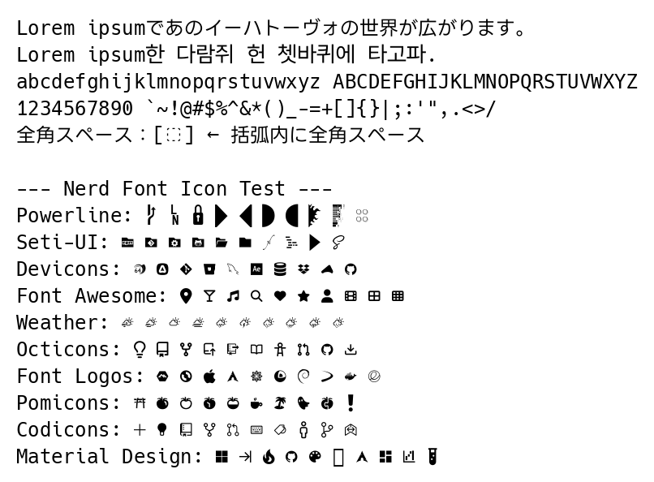
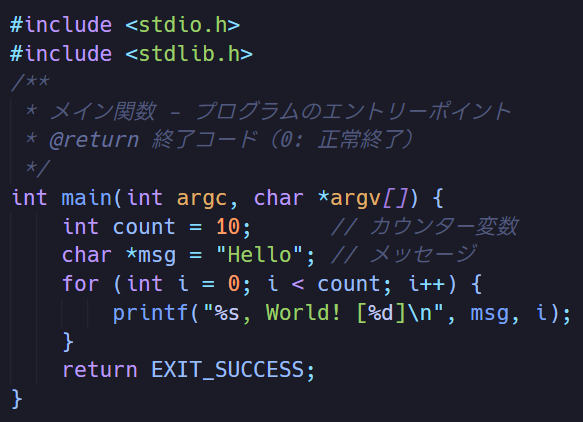

# HackLine

Hack と LINE Seed JP を合成したプログラミングフォント。


## 特徴

- **ラテン文字**: Hack フォント由来（プログラミング向け等幅フォント）
- **日本語文字**: LINE Seed JP 由来（ひらがな、カタカナ、漢字 約7,100文字）
- **Nerd Font対応**: アイコンフォント（Devicons, Codicons, FontLogos等）

|  |  |
|---|---|


## ダウンロード

[**Releases**](https://github.com/nemu626/hackline/releases/latest) から最新版をダウンロードできます。

### 配布ファイル

| ファイル名 | 内容 |
|-----------|------|
| `HackLine-vX.X.X.zip` | 通常版 (Regular, Bold) |
| `HackLineNF-vX.X.X.zip` | Nerd Font版 (アイコン付き) |
| `HackLine-All-vX.X.X.zip` | 全種類セット |

### フォント種類

| フォント名 | 説明 |
|-----------|------|
| **HackLine-Regular/Bold** | 基本フォント。ラテン文字 + 日本語 |
| **HackLineNF-Regular/Bold** | Nerd Font版。上記 + アイコン (Devicons, Codicons, FontLogos, Octicons 等) |

> **💡 Tip**: ターミナルやエディタでアイコンを表示したい場合は **NF版** を使用してください。

## ビルド方法

### 必要なもの

- Python 3.x
- fonttools (`pip install fonttools`)

### ビルド手順

```bash
# 自動ビルド（通常版のみ）
./build.sh

# Nerd Font版も含めてビルド
./build.sh --nerd
```

### 手動ビルド

```bash
# ソースフォントをダウンロード
curl -L -o Hack-v3.003-ttf.zip https://github.com/source-foundry/Hack/releases/download/v3.003/Hack-v3.003-ttf.zip
unzip Hack-v3.003-ttf.zip -d hack_font

curl -L -o LINE_Seed_JP.zip "https://seed.line.me/src/images/fonts/LINE_Seed_JP.zip"
unzip LINE_Seed_JP.zip -d line_seed_font

# Nerd Font patcher をダウンロード (オプション)
curl -L -o FontPatcher.zip https://github.com/ryanoasis/nerd-fonts/releases/download/v3.3.0/FontPatcher.zip
unzip FontPatcher.zip -d font_patcher

# フォントを生成
python3 merge_fonts.py

# Nerd Font版を生成
python3 add_nerd_glyphs.py
```


## ライセンス

- **フォント**: SIL Open Font License 1.1
- **ビルドスクリプト**: MIT License

詳細は [LICENSE](LICENSE), および`/LICENSES` を参照してください。

## クレジット

- [Hack](https://github.com/source-foundry/Hack) - Source Foundry
- [LINE Seed JP](https://seed.line.me/) - LY Corporation
- [Nerd Fonts](https://github.com/ryanoasis/nerd-fonts) - Ryan L McIntyre

## 謝辞
各Fontを配布してくださった各位に感謝します。
また日本語合成フォントやNerd Font対応などに[yuru7](https://github.com/yuru7)氏の[HackGen](https://github.com/yuru7/HackGen)における取組みを参考させていただきました。ありがとうございます。
